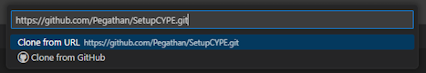

# Project goal

In order to deploy and work on a complete docker environment on a Windows localhost, many softwares are required:
- Docker Desktop, for running and managing containers
- Git, for managing versions
- Visual Studio Code and extensions, a powerfull IDE to manage project and launch code
- Make, to ease deployment and execution of project

Moreover, some configuration files are mandatory in user path.

To ease install and maintenance of all previous elements, PowerShell and Chocolatey are used:
- PowerShell is Windows command-line shell 
- Chocolatey is a package-manager and installer for softwares  

# Install script execution

1. Download ``CTC-CYPE-Install.ps1`` script and save it on your device.
2. Open PowerShell as Administrator
3. Execute this command
```
> PowerShell -ExecutionPolicy Bypass
```
4. Navigate to the folder where you saved ``CTC-CYPE-Install.ps1`` script, using ``cd`` command
5. Execute the script with this command :
```
> .\CTC-CYPE-Install.ps1
```
6. Once all components are installed, restart your computer

# Post-install configuration

1. Open VS Code and click on profile icon at bottom-left. Select "Sign in with GitHub to use GitHub Pull requests and Issues" and enter your GitHub credentials  
  
2. To import a GitHub project locally, in VS Code, open Command Palette by pressing <kbd>Ctrl</kbd> + <kbd>Shift</kbd> + <kbd>P</kbd>, then type ``git clone`` and press <kbd>Enter &#8629;</kbd>  
Enter URL of the project, press <kbd>Enter &#8629;</kbd> and choose destination folder  

3. When import is finished, choose to open the project
4. In VS Code, to open a PowerShell session in the project folder, press <kbd>Ctrl</kbd> + <kbd>ù</kbd>
